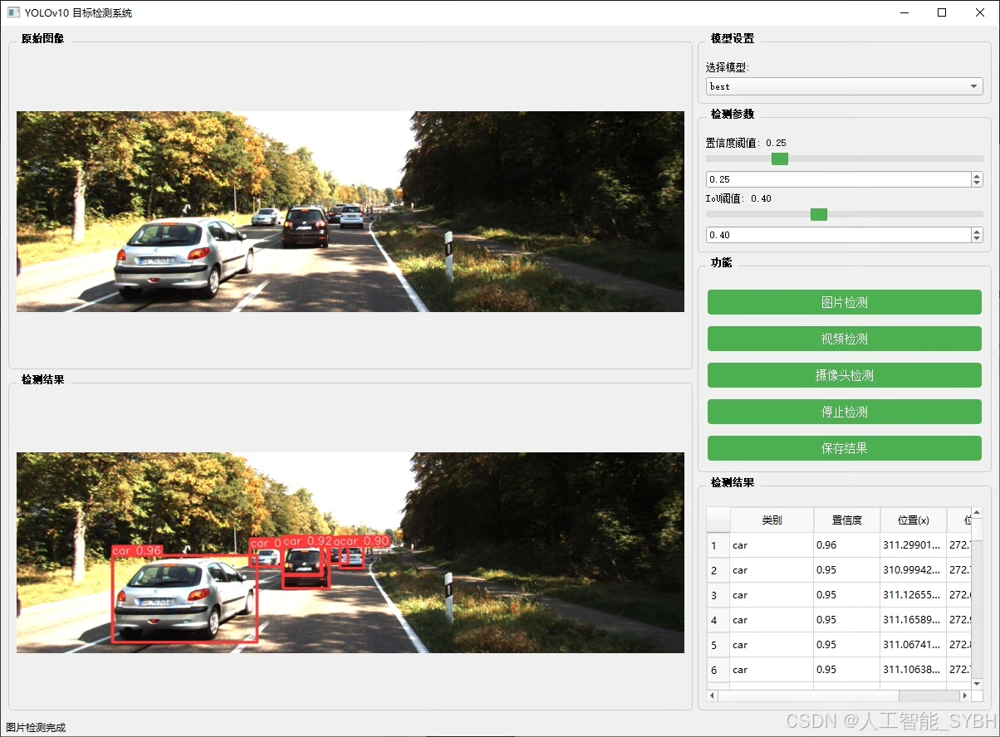
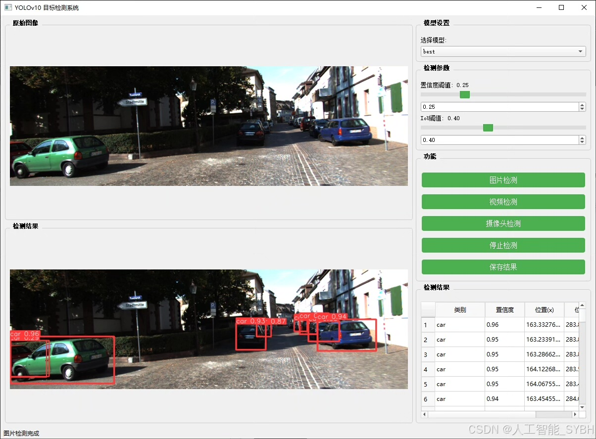
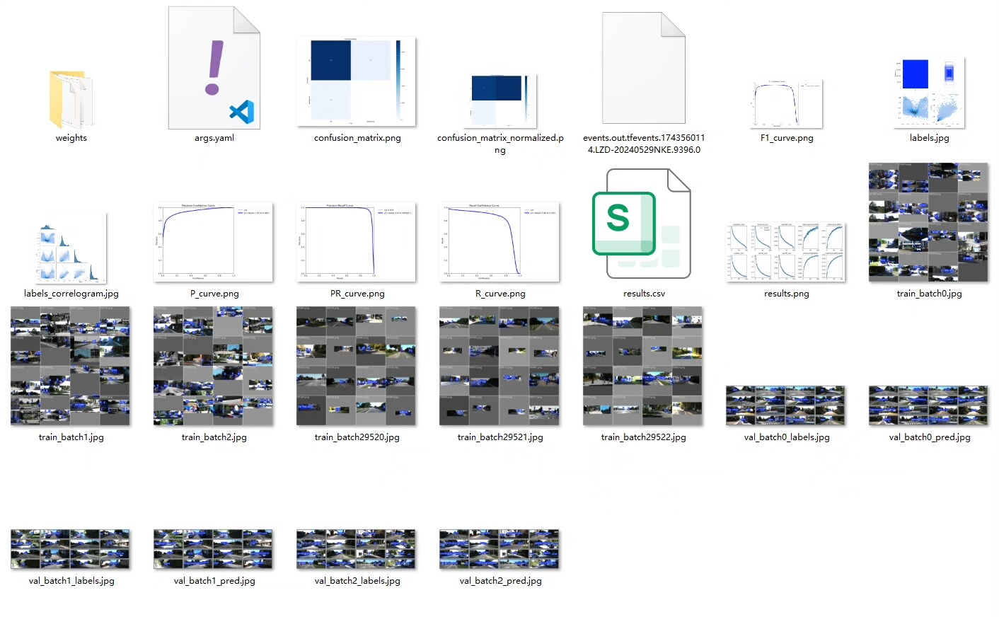
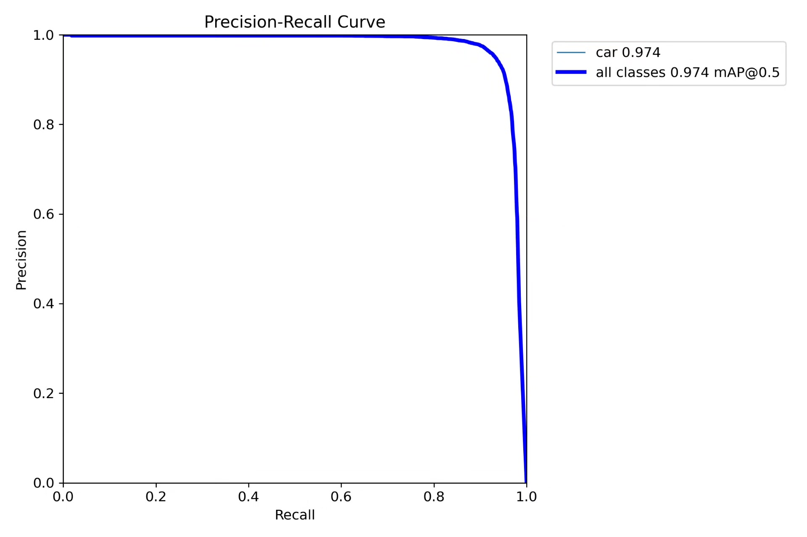
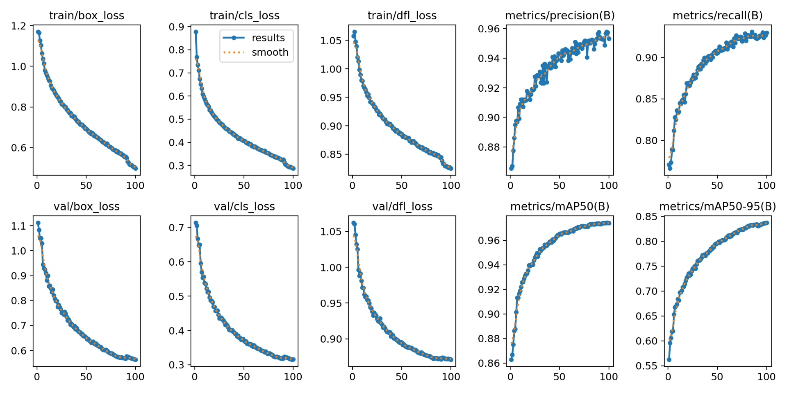
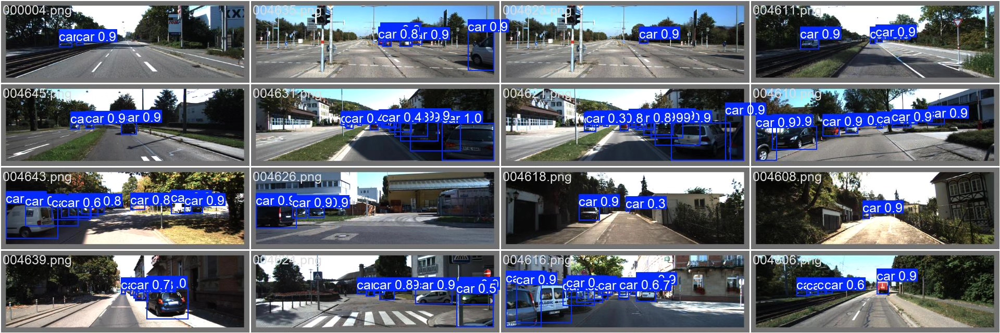
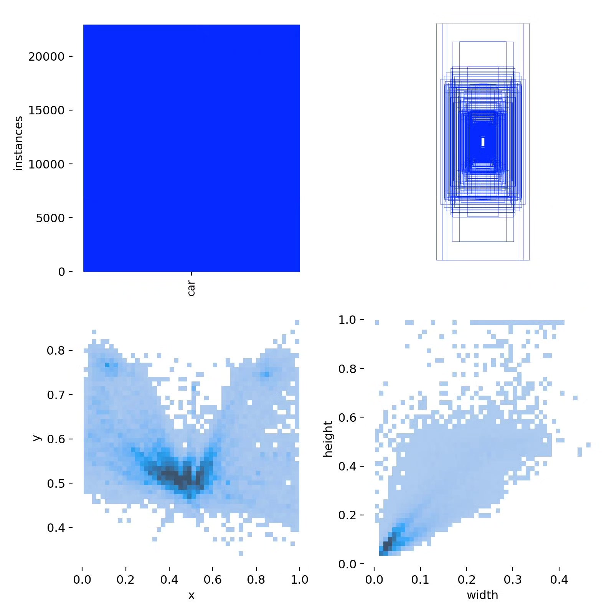
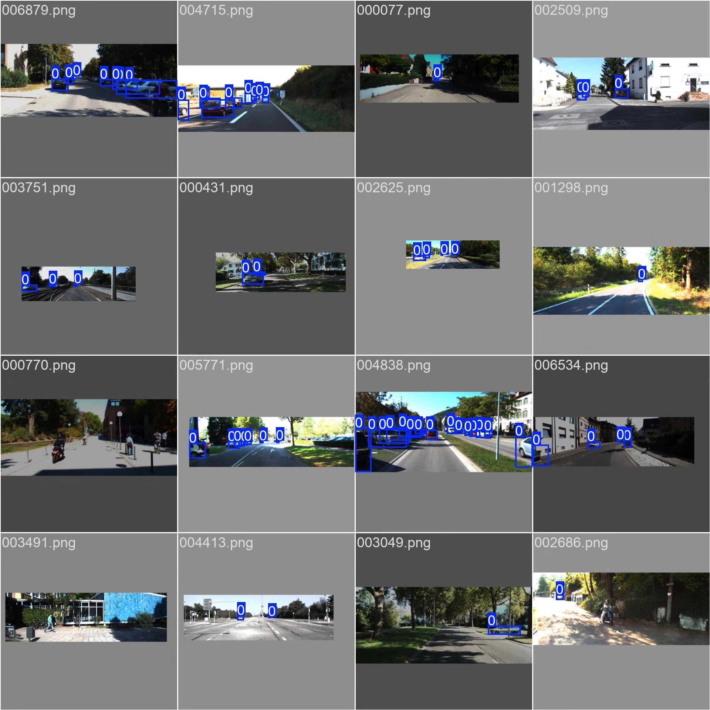

# YOLOv10-based small object vehicle detection system based on deep learning (YOLOv1)

## Body

Based on the YOLOv10 object detection algorithm, this project has developed a highly efficient and accurate small object vehicle detection system. It focuses on detecting small vehicles in images or videos (such as distant vehicles and small vehicles in dense traffic flows). The system adopts an optimized YOLOv10 model structure and combines data augmentation strategies specifically designed for small object detection, significantly enhancing the recognition ability of the model for small-sized vehicles.

The dataset contains 7,481 vehicle images (5,236 training set and 2,245 validation set), covering different lighting conditions, complex backgrounds, occlusion scenarios, and multi-scale vehicle targets, ensuring the robustness of the model in real-world scenarios. This system can be widely applied in intelligent transportation monitoring, autonomous driving perception, drone aerial vehicle detection, parking lot management, and other scenarios, providing key technical support for smart city construction and traffic management.

The company's products have obtained the official commercial license certification from YOLO.

We provide after-sales service:

After payment, we will provide WeChat ID to answer questions anytime.

Environmental configuration: We will provide a tutorial on environmental configuration, and WeChat will provide答疑.

Remote installation service: If you need remote configuration, an additional fee of 69 is required, with all fees refunded if the configuration fails (only refund installation fees for older computers).

Retraining dataset: After configuring the environment, you can train on your own computer. If you need us to retrain, just pay 69 plus computing power fees (2.5 yuan/hour).

Full after-sales service

## Images

## Payment

Here is a pay link on Stripe ( https://buy.stripe.com/3cs8yP7sY87d0vu9AB ). Please contact me lonlonago@foxmail.com after funding $89, and I will send you a complete data files , thank you!

